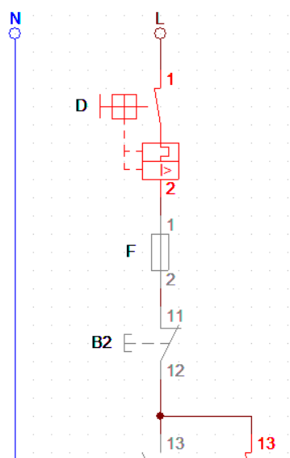

# Acionamentos de dispositivos de proteção

Os equipamentos de proteção são importantes para manter o circuito em bom estado, além de manter o usuário em segurança quando houver sobrecarga e curto-circuito. O acionamento desses equipamentos necessita da instalação correta, para assegurar a proteção das pessoas que acionam esses dispositivos. No Laboratório de instalações e acionamentos elétricos do IFPR - Câmpus Assis Chateaubriand são utilizados os disjuntores e fusíveis como dispositivos de proteção. As instalações desses equipamentos são feitas no início do circuito especificamente em série.

## Acionamento de proteção:

## Acionamento de proteção no diagrama:

