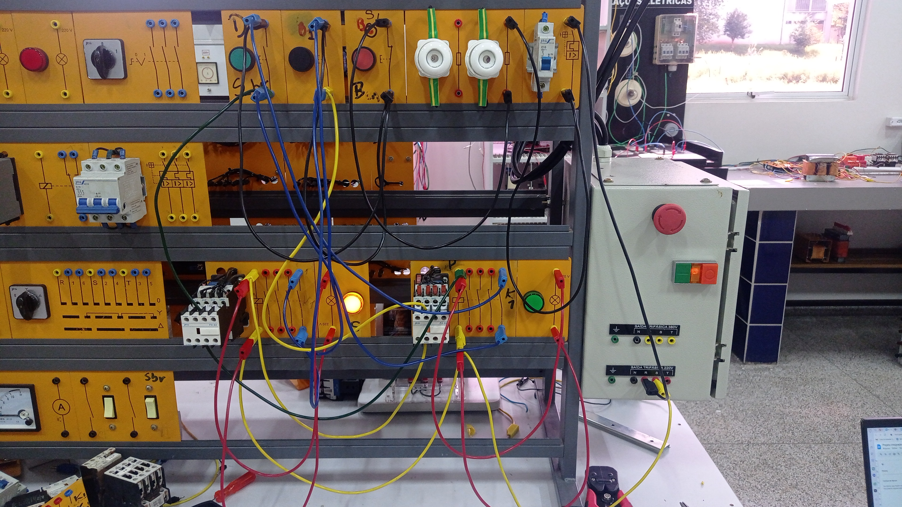
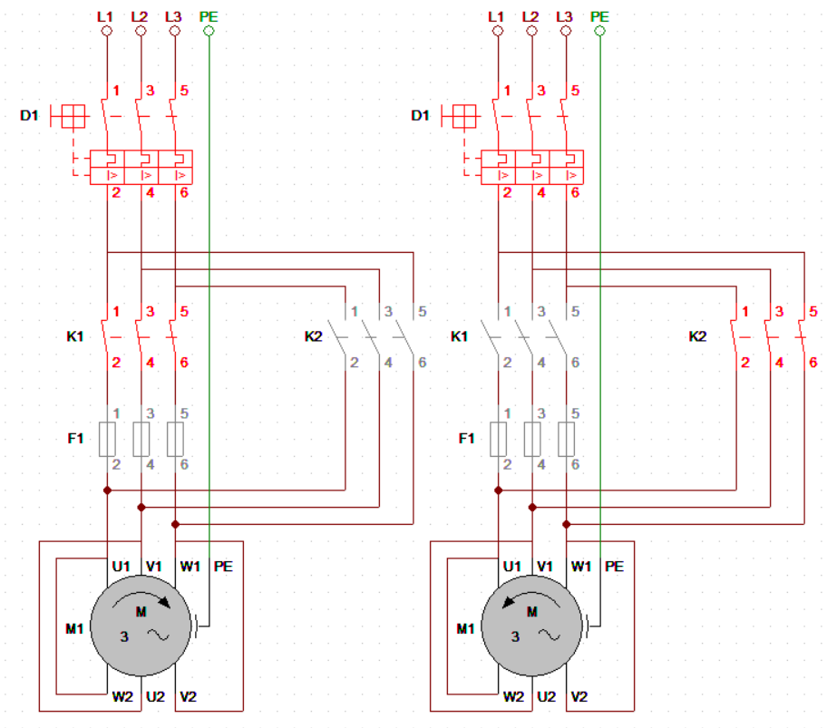

# Partida com reversão

Para a rotação em ambas as direções do rotor é necessária a troca de ordem das bobinas acionadas. Na realização da partida com reversão, a alteração da ordem deve ser por meio de contatores, além disso, utilizam-se botoeiras, contatos auxiliares, dispositivos de segurança: disjuntor e fusível e LEDs – para verificação de funcionamento do comando.

## Comando acionamento

A programação de comando se dá pelo acionamento de B1 em série com o B2. Após isso, em série com essa botoeira está o contato Normalmente Fechado (NF) do Contator K2 e o Contator K1. Em seguida, o contato auxiliar Normalmente Aberto (NA) do contator fica em paralelo com o B1 e o LED (L1) em paralelo com K1. Após esse acionamento, a segunda parte é semelhante a anterior, alterando apenas sua numeração, visto que se encontra B3 em série com o contato NF de K1 e em série com os mesmo K2, em paralelo com B3 estão o contator K2 e o LED (L2) em paralelo com K2.

## Partida de comando no diagrama:

## Comando de força:

O acionamento de força desse comando ocorre com o acionamento do contato de força de K1 e K2 como se fosse uma partida direta, entretando o acionamendo de um dos contatores é feito a troca de pólos, que por consequência faz com que o rotor rotacione para o outro lado.

## Comando de força no diagrama:

## Vídeo para o acionamento:

<video controls>
  <source src={require('./revers.video.mp4').default} />
</video>