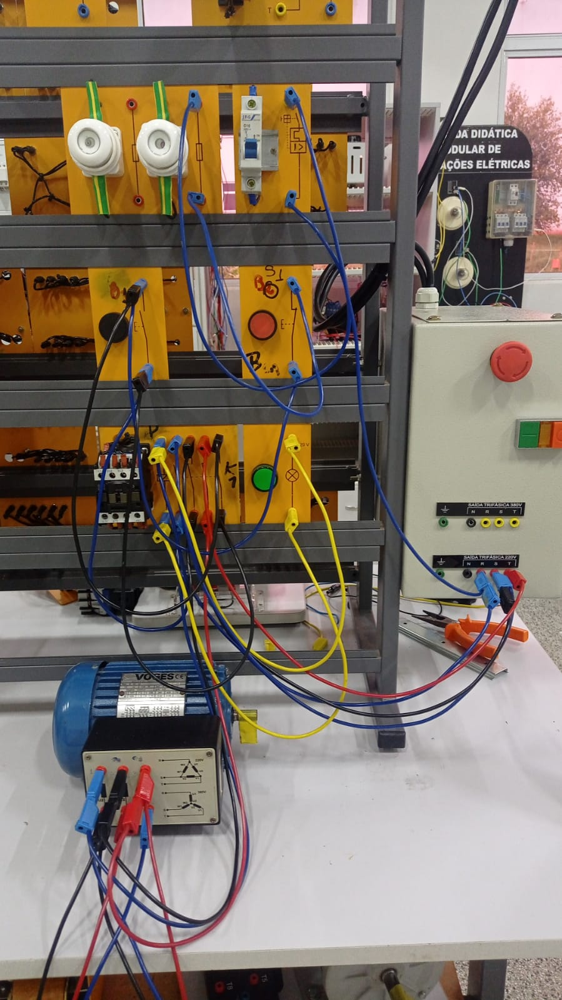

# Partida direta:

Para realização do acionamento de um motor de forma direta, utiliza-se o “Partida Direta”, que por sua vez aciona o motor diretamente sem a necessidade de troca de ordem de pólos. Por consequência, inicia-se a partida direta em triângulo, evitando que o acionamento seja feito com 58% da tensão nominal.
A programação de comando realizada para essa partida necessita de apenas uma contatora, dois botões - normalmente fechado e aberto -, um LED para melhor visualização do funcionamento do acionamento, o motor trifásico e os dispositivos de segurança.

O comando da partida direta é feita com o acionamento dos dispositivos de segurança em série e junto a eles a botoeira normalmente fechada, que tem como finalidade desligar o circuito
Logo após, necessita-se a programação do comando de força que utiliza os contatos de força da contatora, acionamento correto do motor e dispositivos de segurança.

Ocionamento decorre com o com a botoeira normalmente fechada (B1), depois disso ocorre o dimensionamento da botoeira normalmente aberta (B2) em série com B1 e com o contator (K1). Por fim, é feito o intertravamento com a contatora, sendo seu contato auxiliar em paralelo com B2, e para demostração de funcionamento é instalado um LED em paralelo com K1.

## Comando da partida:

## Comando da partida no diagrama:

## Comando de força:

Logo após o comando da partida direta, necessita-se a programação do comando de força que utiliza os contatos de força da contatora, acionamento correto do motor e dispositivos de segurança. Para o comando de força da partida direta, utiliza-se o contato triângulo no motor, além do dimensionamento dos dispositivos de segurança e ligação dos contatos de força do contator.

## Comando de força no diagrama:

## Vídeo para o acionamento:

<video controls>
  <source src="/estre.video.mp4"/>
</video>