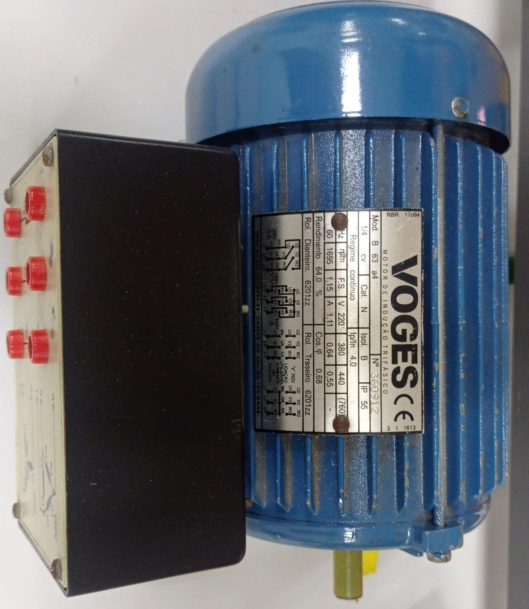

# Motores

No laboratório instalações e acionamentos elétricos do IFPR - Câmpus Assis Chateaubriand é ensinada a realização das partidas de motores, dentre elas a direta, com reversão, estrela triângulo e compensada. Para realização desses acionamentos são utilizados motores trifásicos com 6 pólos. A ligação dos pólos podem variar entre: estrela ou triângulo

## Motor do laboratório:

## Motor gráfico:

