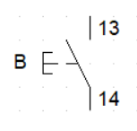
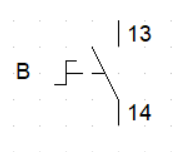
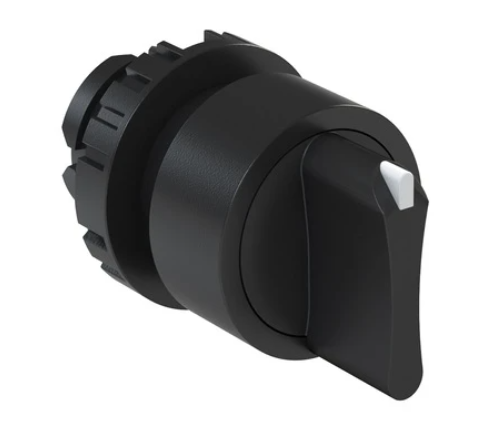
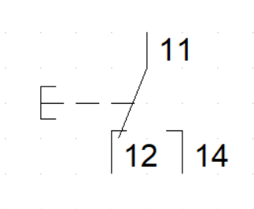
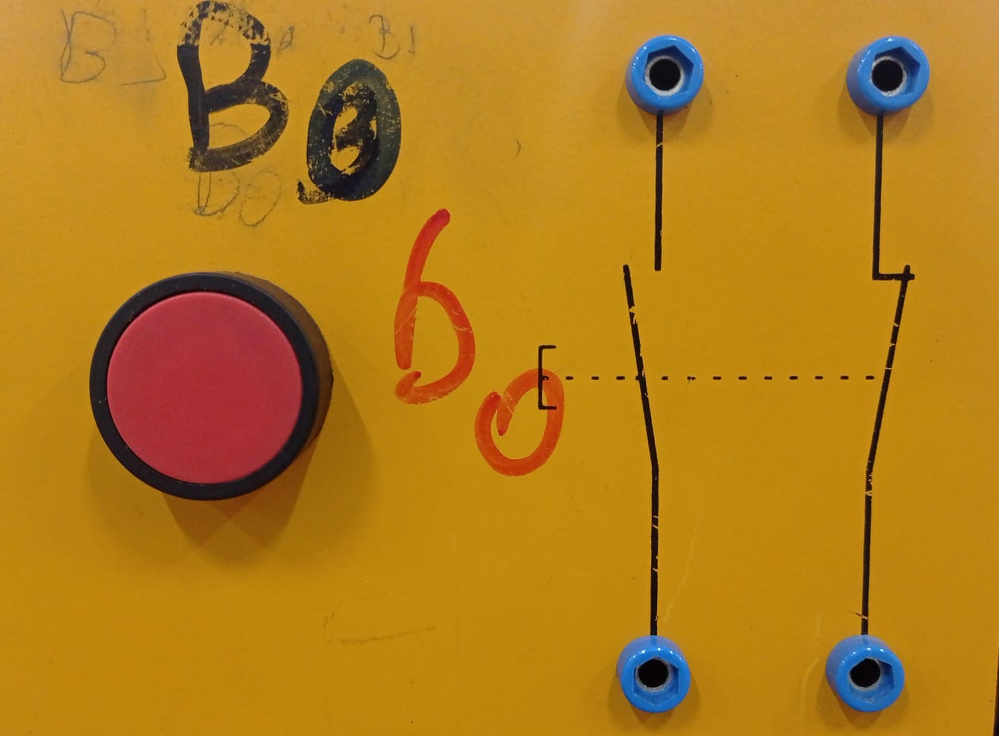
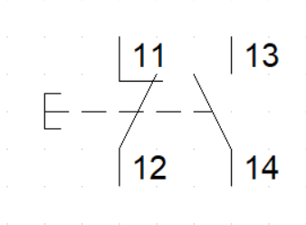
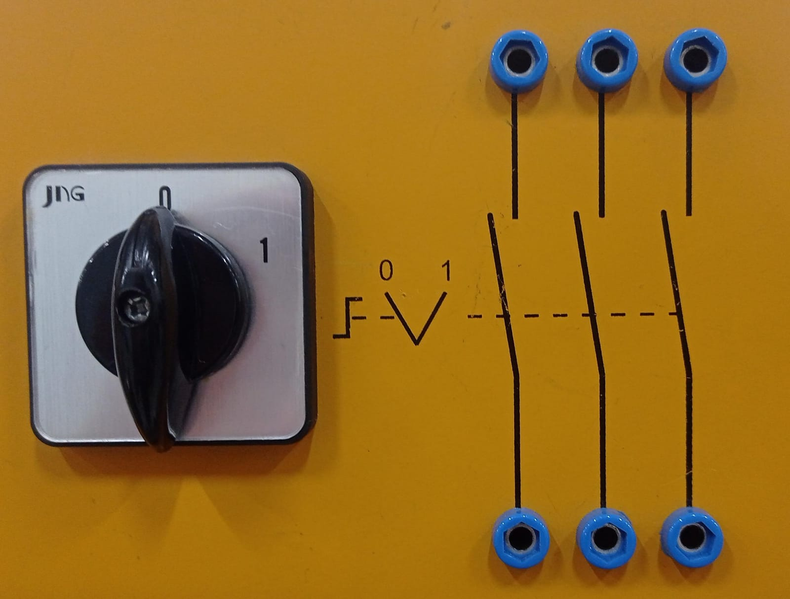
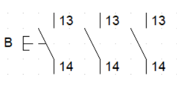

# Botoeiras:

As botoeiras são equipamentos utilizados para o fechamento e a abertura de contatos, permitindo diversos acionamentos conforme a programação desejada. Essas botoeiras podem operar em três tipos de condições: NA (normalmente aberto), NF (normalmente fechado) e comutador (normalmente aberto e fechado). Quando acionadas, mudam de NA para NF e vice-versa. No Laboratório 4, encontram-se as seguintes botoeiras:

## Botoeira retorno por mola:

- Quando pressionada, altera-se de uma condição para outra; e, quando deixa de ser pressionada, volta para sua condição inicial. 

### Botoeira:

### Botoeira gráfica:

## Botoeira com retenção:

- Para o acionamento é preciso pressioná-la, isso mudará sua condição, e mesmo após essa condição o motor continua acionado.

### Botoeira:

### Botoeira gráfica:

## Botoeira comutadora:

- Duas posições funcionam com dois contatos, sendo um deles aberto e outro fechado; quando acionado, um abre o contato e o outro fecha.

### Botoeira:

### Botoeira gráfica:

## Botoeira normalmente aberto e fechado:

- Funciona como dois contatos paralelos sem conexão entre eles; quando acionada, os dois mudam de estado ao mesmo tempo.

### Botoeira:

### Botoeira gráfica:

## Botoeira três passos:

- Funcionam com o acionamento de três contatos; cada giro fecha determinado contato, ao fazer esse fechamento, os outros dois contatos são abertos.

### Botoeira:

### Botoeira gráfica:

