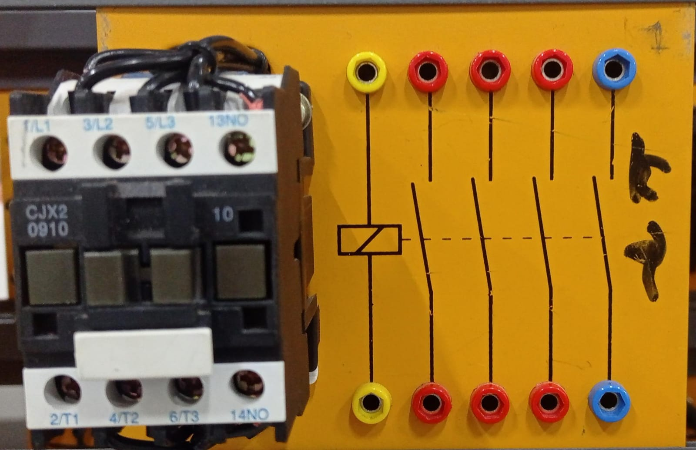
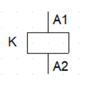
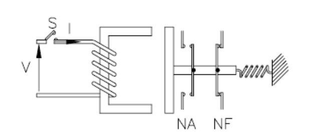
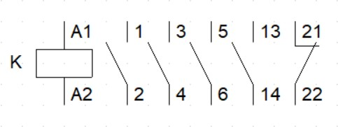

# Contatores

Contatores são dispositivos utilizados para acionar equipamentos que operam com tensões mais elevadas, como os motores trifásicos em aplicações industriais e residenciais. Seu fechamento é realizado por meio da ativação eletromagnética de sua bobina quando uma corrente é aplicada, e sua abertura ocorre com a atuação de uma mola quando não há corrente na bobina.

## Contator do laboratório:

## Contator gráfico:

## Funcionamento. 

Quando o botão S (botoeira) é acionado, fechando o contato, a bobina cria um campo eletromagnético que atrai o componente metálico da esquerda para a direita. Isso resulta no fechamento do contato NA e na abertura do contato NF. Quando o botão é desligado, a mola age como atuador, retornando os contatos à sua posição inicial

## Contatos. 

A contatora de força possui quatro contatos, sendo os três primeiros utilizados para correntes elevadas, enquanto o último, à direita, é um contato auxiliar, podendo ser empregado de diversas maneiras.

