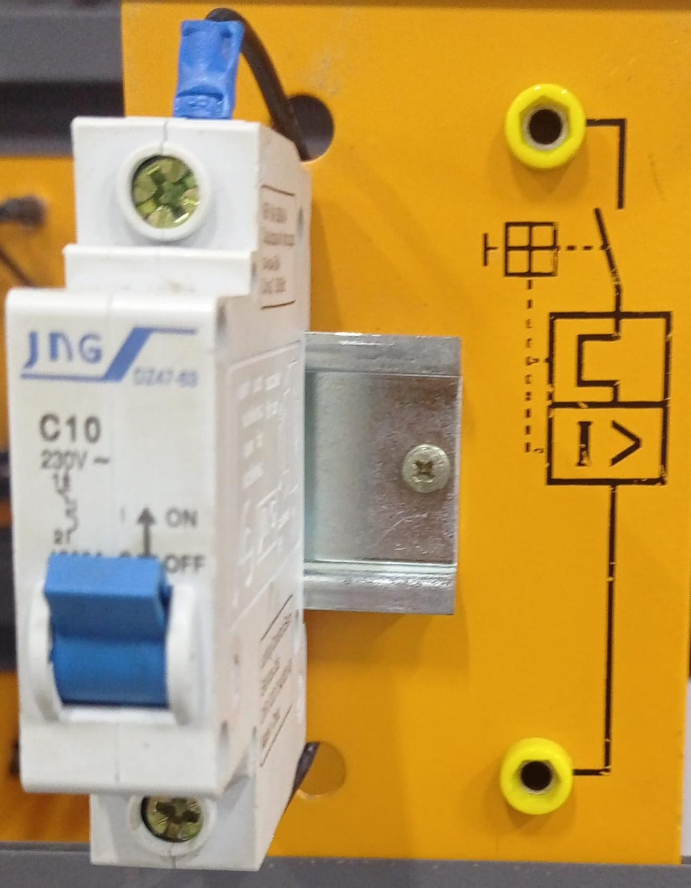
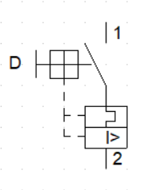
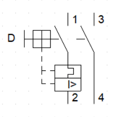

# Disjuntores

A função primordial dos disjuntores é garantir a proteção e a segurança dos circuitos elétricos. Além disso, devido à sua estrutura mecânica, eles possibilitam o seccionamento de circuitos, permitindo a ativação e a desativação de cargas.
Os disjuntores variam entre si com modelos trifásicos, geralmente utilizados em indústrias. Enquanto os bifásicos e monofásicos são mais comuns em residências. A escolha entre essas variações depende da necessidade de tensão específica para cada local.

## Disjuntor monofásico do laboratório:

## Disjuntor gráfico:

## Disjuntor bifásico do laboratório:

## Disjuntor gráfico:

## Disjuntor trifásico do laboratório:

## Disjuntor gráfico:

