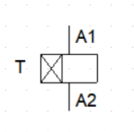

# Temporizadores

O temporizador pode ser utilizado para ativar e desativar dispositivos conforme a necessidade do programador. O temporizador disponível no laboratório de instalações e acionamentos elétricos do IFPR - Câmpus Assis Chateaubriand, é do tipo comutador que redireciona a corrente de uma entrada para outra quando o tempo estipulado é excedido 

## Temporizador do laboratório:

## Temporizador gráfico:

