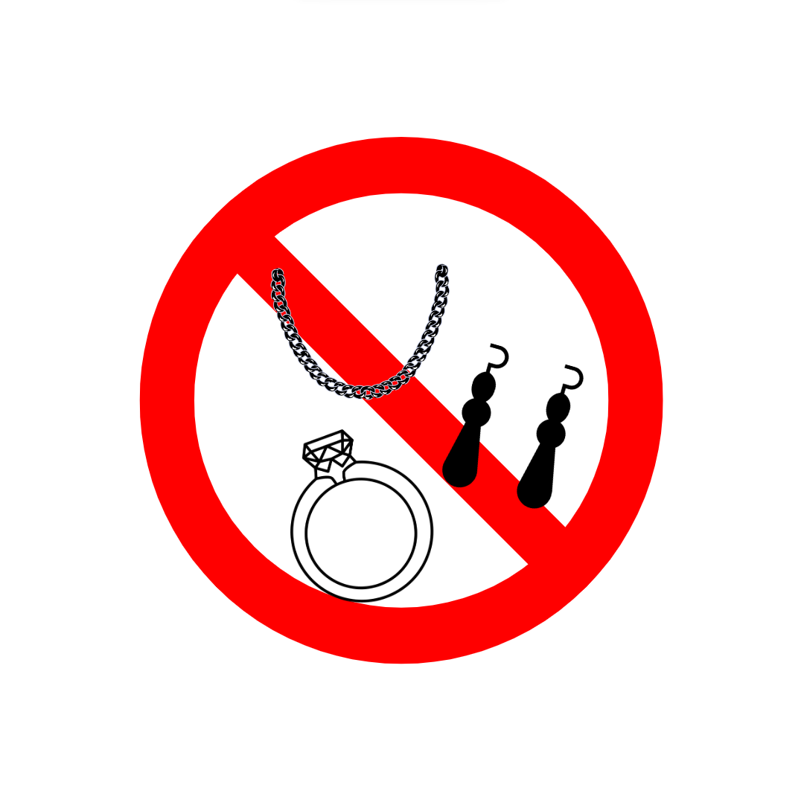
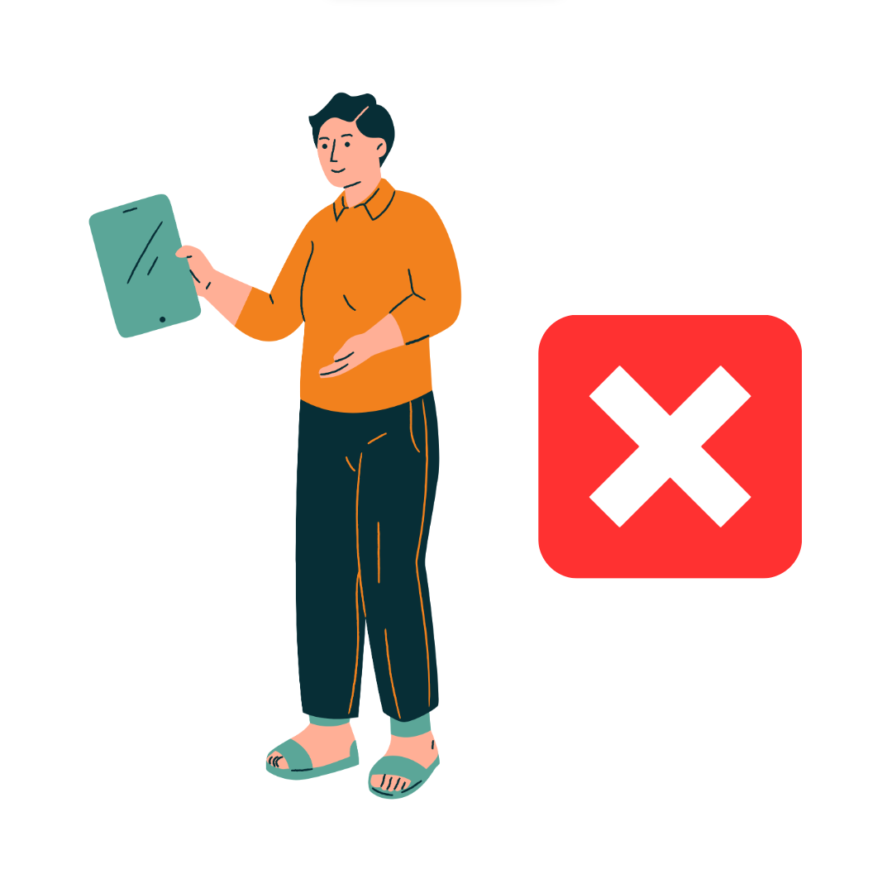
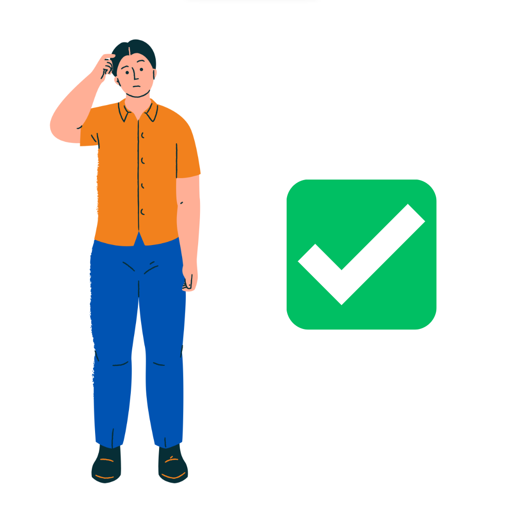

# Utilização do laboratório 

A segurança em ambientes elétricos e rotativos é indubitavelmente importante. À vista disso, as Normas Regulamentadoras (NRs) amparam os indivíduos, desempenhando um papel fundamental para a proteção no manuseio de equipamentos nesses ambientes. 
Nesse sentido, é necessário o conhecimento de qual vestimenta é adequada para operar no Laboratório 4, visto que as NRs 10 e 12 apontam que é incorreto manusear máquinas elétricas utilizando roupas curtas, acessórios e cabelo solto – para quem possui cabelo longo. O usuário pode levar choques elétricos ao utilizar shorts e acessórios, por exemplo. Quanto ao uso dos cabelos soltos, há o risco de prendê-los em máquinas rotativas, esses exemplos divergem das premissas da educação de qualidade buscada pelo IFPR. 
Por isso, a fim de evitar tal dano, o website didático proposto neste trabalho possui uma página que exibe, de forma lúdica, as vestimentas adequadas para o uso no Laboratório de instalações e acionamentos elétricos.

## Vestimenta para uso do Laboratório

- Cabelo: os discentes que utilizam o laboratório e possuem cabelo longo devem amarrá-los para evitar que o cabelo prenda no rotor, que por sua vez é rotativo.

- Acessórios: os discentes que utilizam o laboratório devem retirar os acessórios como: anéis, brincos, colares e pulseiras, para evitar risco de choques elétricos.

- Calçados: os discentes que utilizarão o laboratório não devem estar usando calçados abertos, como exemplo chinelos, sandálias e rasteiras.

- Roupas inferiores: os discentes que utilizarão o laboratório não devem estar usando roupas inferiores que sejam curtas, ou que apresente risco ao utilizar máquinas rotativas, como exemplo saias, shorts e vestidos.

- Vestimentas corretas: Os dicentes que utilizão o laboratório devem utilizar calça comprida, calçado fechado e usar manga curta, para evitar risco de choques elétricos e danos em máquinas rotatívas.

